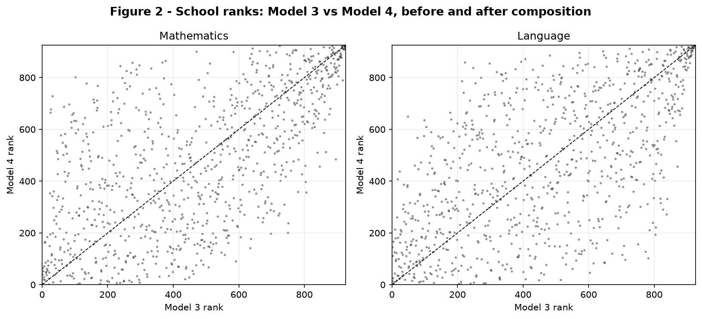

# School Effectiveness and Value-Added Models

*Evidence from Chilean student panel data.* Four value-added specifications are
compared to measure school effectiveness from **student progress** (2004 → 2006)
rather than raw achievement, separately for **Mathematics** and **Language**
(≈76,000 students, 926 schools).

## The question

A school with high final scores may simply enrol high-achieving students.
*Value-added* asks whether students progress **above or below** the level
predicted by their prior achievement. Formally, for student *i* in school *j*:

```
Y(ij) = α + β · X(ij) + ε(ij)          school value-added = school mean of residuals / random effect
```

where `Y` is the 2006 score and `X` the 2004 score. The study separates two
questions that are often conflated:

1. **Estimator** — are school effects measured as OLS residual means or as
   hierarchical (HLM) random effects (which apply shrinkage)?
2. **Reference group** — is the school compared only to students with similar
   *individual* prior scores, or also to schools with a similar *academic
   intake* (composition)?

## The four models

Prior achievement is decomposed as `X(ij) = (X(ij) − X̄(j)) + X̄(j)`, splitting a
student's position **within** the school from the school's average **intake**.

| Model  | Specification                                   | Estimator | Composition |
|--------|-------------------------------------------------|-----------|-------------|
| **M1** | `Y ~ X`                                          | OLS       | no          |
| **M2** | `Y ~ (X − X̄) + X̄`                               | OLS       | yes         |
| **M3** | `Y ~ X + (1 | school)`                           | HLM       | no          |
| **M4** | `Y ~ (X − X̄) + X̄ + (1 | school)`                | HLM       | yes         |

Value-added is the school mean residual (M1, M2) or the predicted school random
effect (M3, M4). Three comparisons isolate each design choice: **M1 vs M3**
(estimator effect), **M2 vs M4** (estimator effect, with composition), and
**M3 vs M4** (composition effect).

## Key results

**Variance decomposition (HLM).** A non-negligible share of variation sits at
school level, and adding composition roughly halves the ICC — part of the
apparent school effect is really the academic intake of the cohort:

| Subject     | Model | R²    | RMSE  | σ²_school | σ²_resid | ICC   |
|-------------|-------|-------|-------|-----------|----------|-------|
| Mathematics | M3    | –     | 37.14 | 675.5     | 1395.6   | 0.326 |
| Mathematics | M4    | –     | 37.17 | 249.6     | 1396.0   | 0.152 |
| Language    | M3    | –     | 33.17 | 311.7     | 1112.9   | 0.219 |
| Language    | M4    | –     | 33.21 | 108.1     | 1113.6   | 0.088 |

**Ranking stability.** When the covariates are fixed, OLS and HLM rank schools
almost identically; the decisive change comes from **composition**:

| Comparison            | Subject     | Spearman | Median ΔRank |
|-----------------------|-------------|----------|--------------|
| M1 vs M3 (estimator)  | Mathematics | 0.973    | 38           |
| M1 vs M3 (estimator)  | Language    | 0.978    | 33           |
| M3 vs M4 (composition)| Mathematics | **0.620**| **148.5**    |
| M3 vs M4 (composition)| Language    | **0.607**| **149.5**    |



Across subjects, Model-4 value-added correlates positively but imperfectly
(Pearson 0.60, Spearman 0.54): school effectiveness is partly general, partly
subject-specific.

**Conclusion.** The main empirical difference is *not* OLS vs HLM — with the same
covariates the two agree. What moves rankings is **composition**: once the
cohort's average intake is controlled for, schools are judged against a different
benchmark, and many positions change. Value-added estimates are therefore
conditional, model-based indicators — not neutral league tables, and not causal
measures of school quality.

## Repository structure

```
school-performance-study/
├── data/
│   ├── mi_base.xlsx         # student panel (git-ignored) — see data/README.md
│   └── README.md            # data dictionary
├── src/                     # Python analysis pipeline
│   ├── config.py            # paths, schema, model definitions
│   ├── data_prep.py         # load Excel, build Maths/Language samples
│   ├── models.py            # M1-M4 (OLS + HLM), value-added, variance decomposition
│   ├── rankings.py          # Spearman comparisons, transitions, distributions (Tables 4-8)
│   ├── plots.py             # rank-comparison and supporting figures
│   └── main.py              # end-to-end pipeline (entry point)
├── results/                 # generated outputs (git-ignored): tables/ + figures/
├── assets/                  # figure embedded in this README
├── docs/                    # the research report (git-ignored)
├── legacy_R/
│   └── microeconometrics_send.R   # original R script (reference implementation)
├── environment.yml          # conda environment
└── requirements.txt         # pip dependencies
```

## Reproduce

Place the data file at `data/mi_base.xlsx`, then, using **conda**:

```bash
conda env create -f environment.yml
conda activate andrea
python -m src.main
```

Or with **pip**: `pip install -r requirements.txt` then `python -m src.main`.
This writes every result table to `results/tables/` and the figures to
`results/figures/`, and prints the main tables to the console.

## Python ↔ R replication

The analysis was first written in **R** (`lme4`) and rewritten in **Python**
(`statsmodels`). The two agree: the descriptives, R² / RMSE / variance
components / ICC, the coefficients, the Spearman rank correlations, the
value-added distribution and the Maths–Language correlation all match the report.

A few numbers differ only in the last digits, because R's `lme4` and Python's
`statsmodels` fit the hierarchical models with different internal optimisers (and
report a couple of quantities slightly differently). These differences are tiny
and change none of the conclusions: the Mathematics M3 intercept differs by about
0.3, the M4 `AIC` by less than 10, and a handful of schools fall on the other
side of a quartile boundary in the transition table (Table 5).

The R script additionally emits LaTeX tables and a formatted Excel workbook,
which the port does not reproduce. The R script is kept in
[`legacy_R/`](legacy_R/) as the reference implementation.

## Data

Chilean student panel, 2004 and 2006, Mathematics and Language. The microdata
are **not published** (national ids); `data/` is git-ignored. See
[`data/README.md`](data/README.md) for the schema.
